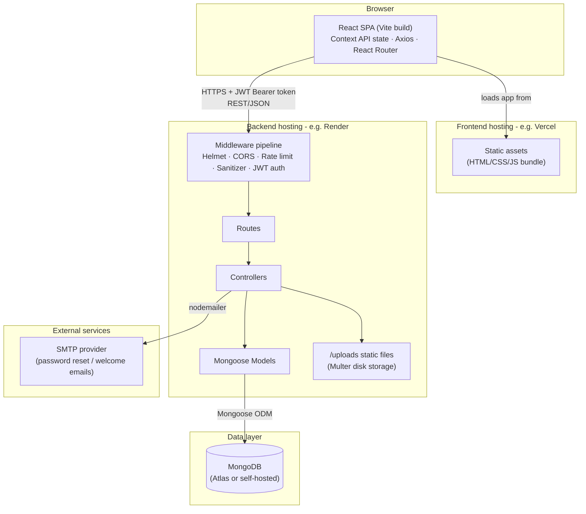
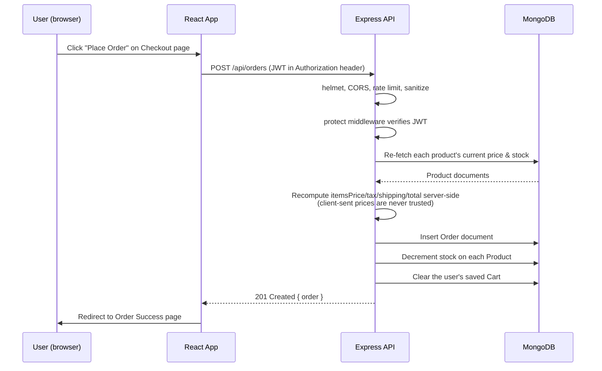

# System Architecture

## High-level overview

## Request lifecycle (example: placing an order)

## Layer responsibilities

| Layer | Responsibility |
|---|---|
| **React SPA** | Rendering, client-side routing, optimistic UI (e.g. cart updates), form validation |
| **Context (Auth/Cart/Theme)** | Cross-cutting client state that many components need, without prop drilling |
| **Services (axios)** | One file per API resource; the only place that knows API URLs/shapes |
| **Express middleware** | Cross-cutting request concerns: security headers, CORS, rate limiting, input sanitization, JWT verification |
| **Routes** | URL → controller mapping, plus per-route middleware (auth, validation, upload) |
| **Controllers** | Request/response handling and business logic (pricing, stock checks, aggregation) |
| **Models (Mongoose)** | Schema, validation, and instance methods (password hashing, JWT signing, review-rating recalculation) |
| **MongoDB** | Persistence |

## Why this split

- **Stateless API + JWT** means the backend can be horizontally scaled (multiple Render
  instances) without a shared session store - any instance can verify any request's
  token independently.
- **Server-side price/stock re-validation** on order creation means the frontend is never
  a trust boundary - a tampered request still gets priced from the database, not the
  request body.
- **Local file storage for uploads** is the simplest option for a single-instance
  deployment and keeps the bonus "Image Upload with Multer" requirement self-contained,
  but it means uploaded images won't survive a redeploy on ephemeral-filesystem hosts
  like Render's free tier - see the [deployment guide](DEPLOYMENT_GUIDE.md) for the
  cloud-storage swap-in point.
