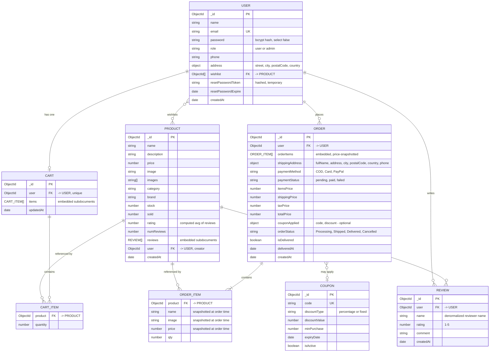

# Entity-Relationship Diagram

This reflects the actual Mongoose schemas in `server/models/`. MongoDB is schema-flexible,
but the application enforces this shape at the ODM layer.

## Notes on the design

- **Reviews are embedded in Product**, not a separate top-level collection. This matches
  the brief's schema (`Products.reviews`) and keeps "get product + its reviews" to a
  single read. The trade-off is that a very heavily-reviewed product grows one document;
  acceptable at this scale, but a collection with the usual `product`/`user` fields would
  be the fix at a much larger scale.
- **Order line items snapshot `name`/`image`/`price`** at the moment of purchase, rather
  than only storing a `Product` reference. This is deliberate: if a product's price or
  name changes later, past orders must still show what the customer actually paid for.
- **Cart items only store a reference + quantity** (no price snapshot) because a cart, unlike
  an order, is expected to reflect *current* prices until checkout.
- **Wishlist is a plain array of `ObjectId`s on User** rather than a join collection,
  since it carries no extra fields (no "date added", no notes) - if that changes, it
  would become its own collection.
